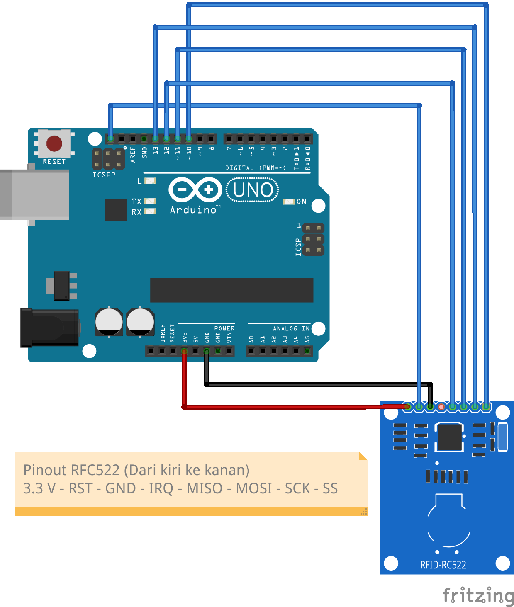

# Tutorial Penggunaan Software

⚠️ Pastikan **[Node.js](https://nodejs.org/en)** telah terinstall di komputer anda!
📌 Semua bagian yang menggunakan **Arduino Uno** digunakan **PlatformIO IDE dari VSCode**, jadi upload kode ke Arduino menggunakan PlatformIO!

## Penulis Kartu RFID

1. Rangkai rangkaian Arduino sebagai berikut

1. Hubungkan Arduino Uno ke komputer anda
2. Upload kode penulis kartu RFID ke Arduino dari repository https://www.github.com/aerohoundteknologi/Write-RFID (Clone repository dan buka dengan VSCode lalu upload kode dengan PlatformIO)
3. Clone repository https://www.github.com/aerohoundteknologi/Write-RFID-CSV/, buka dan isi data pada file `.csv` dengan format berikut
4. ID HARUS dimulai dari satu!!
    
    
    | id | name | company |
    | --- | --- | --- |
    | 1 | John | SD Corp |
    | 2 | Doe | SD Corp |
    | 3 | Sharon | SD Corp |
    
4. Dengan **terminal** jalankan perintah `node index.js`
    
    **JANGAN TAP KARTU RFID TERLEBIH DAHULU!!** Tunggu hingga perintah `Tap your card to RFID Reader to continue..` keluar baru kartunya di tap!
    
5. Bila selesai (keluar pesan `Success writing on RFID Card with ID: id`), anda bisa siapkan kartu berikutnya untuk di **write** lagi!
6. Ulangi langkah hingga semua kartu sudah di **write!**
